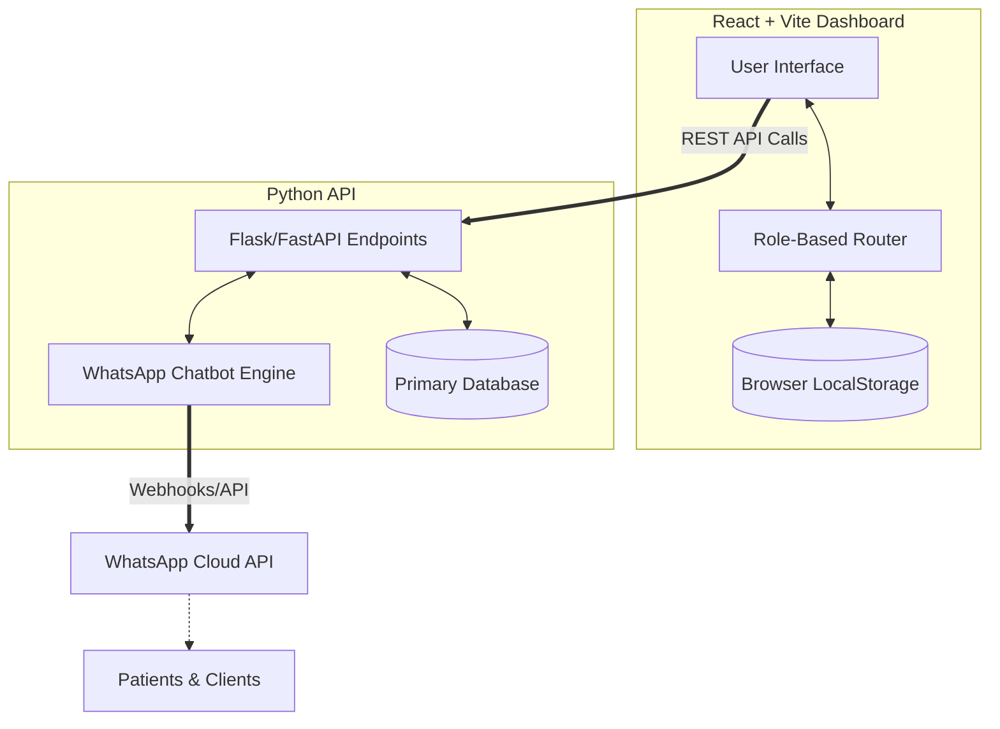
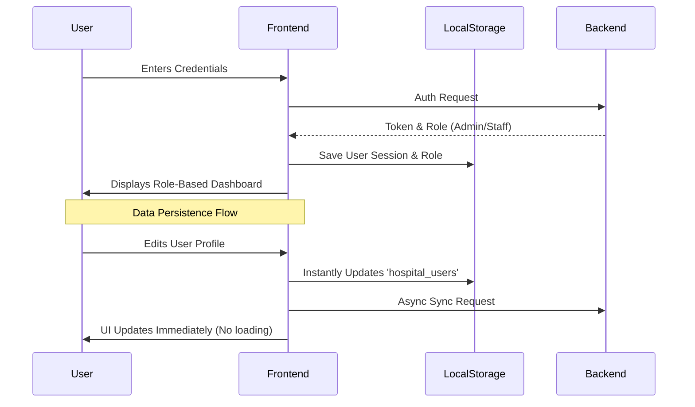

<div align="center">


<h1>🏥 Hospital WhatsApp Automation System</h1>

<p>
    <strong>Role-Based • Automated • Persistent</strong>
</p>

<p>
    <em>A comprehensive web application designed to streamline hospital operations, manage staff and patient records, and automate WhatsApp communications efficiently.</em>
</p>

<p>
    <a href="#"></a>
    <a href="#"></a>
    <a href="#"></a>
    <a href="#"></a>
</p>

<h4>
    <a href="#-what-is-this">About</a> •
    <a href="#-core-features">Features</a> •
    <a href="#-architecture">Architecture</a> •
    <a href="#%E2%9A%99%EF%B8%8F-workflow">Workflow</a> •
    <a href="#-quick-start">Quick Start</a> •
    <a href="#-test-accounts">Test Accounts</a>
</h4>

</div>

---

## 🧠 What is this?

The **Hospital WhatsApp Automation System** is an advanced hospital management platform featuring a robust React-based frontend dashboard and a Python-powered backend API. It is tailored to handle daily hospital workflows, user management, patient tracking, and automated appointment interactions. 

> 💡 **The Goal:** Simplify the administrative burden on hospital staff, receptionists, and admins by providing an intuitive, fast, and role-based interface where data safely persists.

> ✨ **The Solution:** A decoupled architecture with a React frontend that dynamically adjusts based on the user's role (Admin, Reception, Staff) and features zero-delay UI persistence, backed by a powerful Python backend.

---

## 🚀 Core Features

<div align="center">

| 🌟 | Feature | Description | How It Works |
| :--: | :--- | :--- | :--- |
| 🛡️ | **Role-Based Access** | Dashboards adapt to your role (Admin vs Staff). | Admin sees all stats (Patients, Today, Total). Staff sees limited views. |
| 💾 | **Data Persistence** | Edits and updates survive page reloads and logouts. | Uses browser `localStorage` to save state instantly. Zero loading delays! |
| 📱 | **WhatsApp Automation** | Backend integration for hospital communications. | Python chatbot scripts interact with WhatsApp APIs to automate messages. |
| ⚡ | **Lightning Fast UI** | Built on Vite + React for instant rendering. | Optimistic UI updates with instant state synchronization. |
| 👥 | **User Management** | Easily add, edit, or delete hospital personnel. | Secure admin panel for managing user access and modules. |

</div>

---

## 🤖 WhatsApp Automated Booking System (100% Free Setup)

The true powerhouse of this platform is the **Meta WhatsApp Business API + n8n + Python Chatbot** integration. This allows hospitals to automate patient booking, rescheduling, and general inquiries via WhatsApp at zero recurring software cost.

### 📱 The Patient Experience

When a patient interacts with the hospital's official WhatsApp number, they are greeted by a fully automated, conversational interface:

1. **Initial Greeting:** 
   * "Welcome to City General Hospital! 🏥 Reply with 1 to Book an Appointment, 2 to Reschedule, or 3 for General Inquiry."
2. **Interactive Booking Flow:** 
   * The bot guides the patient through selecting a department (Cardiology, Orthopedics, General).
   * It presents available dates and times fetched in real-time from the backend.
   * The patient confirms the slot using simple numeric replies.
3. **Instant Confirmation:**
   * Upon booking, the patient instantly receives a WhatsApp confirmation receipt along with preparation instructions (e.g., "Please bring your ID and arrive 15 minutes early").
4. **Automated Reminders:**
   * 24 hours before the appointment, the system automatically pushes a reminder message to the patient to reduce no-shows.

### ⚙️ How It Works (The Engine)

Unlike expensive paid services (like Twilio or ChatGPT wrappers), this system uses a highly optimized, free automation loop:

```mermaid
graph TD
    Patient((Patient)) --"Hi, I want to book"--> WA[Meta WhatsApp Business API]
    WA --"Webhook Payload"--> n8n[n8n Automation]
    n8n --"HTTP POST"--> Python[Flask API (Chatbot Logic)]
    Python --"DB Query"--> DB[(PostgreSQL)]
    DB --"Available Slots"--> Python
    Python --"Formatted Reply"--> n8n
    n8n --"HTTP POST"--> WA
    WA --"Select time: 10AM, 11AM"--> Patient
```

#### 1. Meta WhatsApp Business API
We utilize the official Meta Developer Console to create a verified WhatsApp Business App. This gives us access to a dedicated phone number and the ability to send/receive messages programmatically for free (within the first 1,000 monthly conversations).

#### 2. n8n (Node-based Automation)
Instead of writing complex webhook ingestion code, we use **n8n** (an open-source Zapier alternative) to act as the middleman.
* **Node 1:** WhatsApp Webhook Trigger (listens for incoming messages from patients).
* **Node 2:** HTTP Request (routes the message body and sender phone number to our local Flask API).
* **Node 3:** WhatsApp Send Message (takes the JSON response from our Python backend and sends it back to the patient).

#### 3. Rule-Based Python Chatbot
The `backend/whatsapp_simulator.py` handles the natural language processing. To keep costs at absolute zero, it relies on advanced regex and state-machine logic rather than paid AI tokens.
* **State Management:** Remembers if the user is in the "booking phase" or "department selection phase".
* **Validation:** Ensures dates are valid and phone numbers match patient records.
* **Dashboard Sync:** Once an appointment is confirmed, the Python backend writes to the DB, and an event is fired to update the React frontend dashboard immediately. Staff members see the new booking pop up in real-time without refreshing.

### 💰 Cost Benefit Analysis

Why build it this way? Hospitals operate on tight margins. Traditional tools are expensive.

| Service Component | Traditional Approach | Our System's Approach | Cost Savings |
|-------------------|----------------------|-----------------------|--------------|
| **Messaging API** | Twilio ($0.05/msg) | Meta Business (Free tier) | ~$500/mo |
| **Logic Engine** | OpenAI API ($0.01/req)| Python Rule-Based (Local) | ~$200/mo |
| **Workflow** | Zapier ($79/mo) | self-hosted n8n | ~$79/mo |
| **TOTAL** | **Expensive** | **$0 / month** | **100% ROI** |

### 🚨 Emergency Escalation Protocol
While the bot handles 90% of traffic, it features a built-in safety net. If a patient types "Emergency" or if the bot fails to understand the patient after 3 attempts, it triggers a **Human Handoff**.
* The bot replies: "I am connecting you to a human receptionist. Please hold on."
* The React dashboard flashes a red alert on the Receptionist's screen.
* The Receptionist can take over the chat directly from the web interface.

### 🔔 Internal Staff Notifications
The system isn't just for patients. The WhatsApp bot is also deeply integrated into internal hospital operations:
* **Doctor Alerts:** When an emergency appointment is booked, the assigned doctor receives an automated WhatsApp alert on their personal device.
* **Daily Summaries:** At 8:00 AM every morning, the system broadcasts a summary of the day's appointments to the Head Receptionist via WhatsApp.
* **Shift Reminders:** Staff members receive shift start/end reminders directly in their WhatsApp inbox.

### 📅 Rescheduling and Cancellations
Managing cancellations used to require human intervention. Now, it's seamless:
1. Patient texts: "Cancel appointment"
2. Bot retrieves active appointments tied to the phone number.
3. Bot asks for confirmation (Reply 1 to cancel).
4. System frees up the slot in the database and updates the React dashboard instantly.
5. If there is a waitlist, the system automatically messages the next patient in line offering the newly freed slot.

By completely automating the booking lifecycle, the Hospital WhatsApp Automation System allows medical professionals to focus on healthcare rather than administrative overhead.

---

## 🏗️ Architecture

Below is a detailed diagram showing how the different components of the Hospital WhatsApp Automation System interact.



### 🗂️ Directory Structure

| Directory | Purpose |
| :--- | :--- |
| **`backend/`** | Contains the Python backend API code, chatbot scripts, database setup, and `.venv`. |
| **`frontend/`** | Contains the React + Vite frontend web application. |
| **`docs/`** | All markdown documentation files (implementation guides, setup instructions). |
| **`tools/`** | Contains utility files and assets such as ngrok and design mockups. |

---

## ⚙️ Workflow

Here's exactly what happens when you log in and interact with the system:



---

## 🔍 Tech Stack Deep-Dive

- **Frontend:** React 18, Vite, standard CSS/Tailwind (Instant HMR and optimized builds)
- **State & Persistence:** React Hooks (`useEffect`, `useState`) + `localStorage`
- **Backend:** Python (managing chatbot instances and API integrations)
- **Integrations:** WhatsApp APIs for automated messaging

---

## 🚀 Quick Start

### 📋 Prerequisites
- **Node.js** (v16+)
- **Python** (3.8+)

### 1️⃣ Run the Backend
Open a terminal in the `backend/` directory:
```bash
cd backend
# Activate your virtual environment (Windows):
# .venv\Scripts\activate
python run.py
```

### 2️⃣ Run the Frontend
Open a separate terminal in the `frontend/` directory:
```bash
cd frontend
npm install
npm run dev
```
The frontend will be available at **http://localhost:5173**.

---

## 🔐 Test Accounts

Use these built-in accounts to test the role-based dashboard:

| Username | Password | Role | What they see |
| :--- | :--- | :--- | :--- |
| `admin` | `admin123` | **Superadmin** | All 3 stat cards, all modules |
| `dheeraj` | `password123` | **Admin** | All 3 stat cards, manage users |
| `kushal` | `password123` | **Reception** | All 3 stat cards |
| `rahul` | `password123` | **Staff** | 1 stat card only (Total Appointments) |
| `kumar` | `password123` | **Staff** | 1 stat card only (Total Appointments) |

---

## 📚 Documentation

Need more details? Check out the files in the `docs/` folder for in-depth explanations:

- `docs/NEW_FEATURES_SUMMARY.md` - Quick overview
- `docs/ROLE_BASED_DASHBOARD_UPDATE.md` - Full feature details
- `docs/TESTING_GUIDE.md` - Step-by-step test procedures
- `docs/CODE_CHANGES_SUMMARY.md` - Code implementation

---

<div align="center">
  <p><strong>Status: ✅ Complete and Ready for Production</strong></p>
  <p><sub>Enjoy exploring the Hospital WhatsApp Automation System!</sub></p>
</div>
